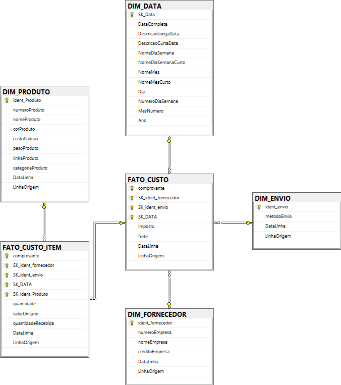
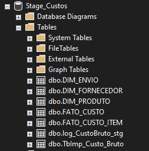
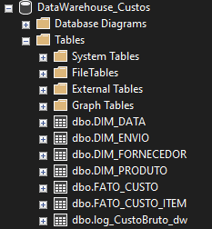
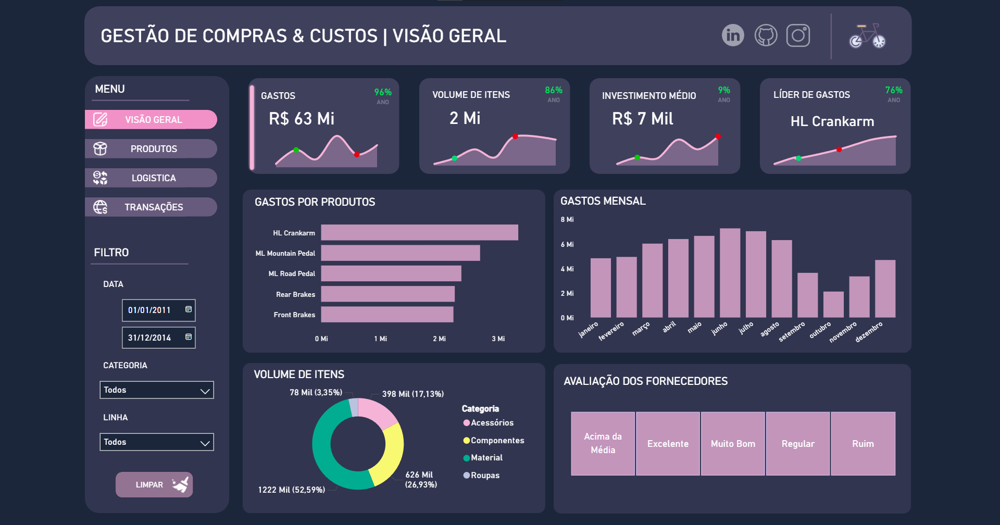

# 🏗️ Pipeline de Dados e DW Nativo: Alocação de Custos no AdventureWorks


---

## 🔗 Conecte-se Comigo
Para dúvidas, parcerias ou oportunidades profissionais, sinta-se à vontade para me contatar:

*   **LinkedIn:** [Acesse meu perfil profissional aqui](https://www.linkedin.com/in/vini31/)

---

## 📌 Sobre o Projeto
Este projeto demonstra a construção de um ecossistema de dados robusto, composto por camadas de **Staging** e **Data Warehouse (DW)**, focado na análise estratégica de **Custos de Aquisição e Compras**.

O diferencial deste pipeline é a orquestração via **Stored Procedures (T-SQL Native)**, realizando transformações complexas diretamente no motor do banco de dados (abordagem ELT).

## 🗄️ Fonte de Dados (Database Source)
Este projeto utiliza o banco de dados de exemplo da Microsoft.
* **Database:** `AdventureWorks2012` (ou versões superiores).
* **Download Oficial:** [AdventureWorks sample databases](https://github.com/Microsoft/sql-server-samples/releases/tag/adventureworks)

---

## 🎯 O Desafio de Negócio: Alocação de Custos
Um desafio crítico resolvido neste projeto foi a **precisão na alocação de custos indiretos** (Frete e Imposto).

* **O Problema:** Custos de frete e imposto são aplicados ao **pedido** (Header), mas a análise de rentabilidade precisa ser por **produto** (Item).
* **A Solução:** Implementação de uma arquitetura com duas tabelas Fato em granularidades distintas, utilizando lógica de rateio e `DISTINCT` para evitar a **duplicidade de valores**.

## ⚙️ Arquitetura de Dados (Snowflake Schema)
A modelagem segue o padrão **Snowflake**, garantindo normalização e integridade.

### **Diagrama do Data Warehouse:**

*Visualização das relações entre dimensões e tabelas fato no SQL Server.*

### **Visualização das Tabelas (Physical Schema):**

| Camada de Staging (`Stage_Custos`) | Camada de Data Warehouse (`DataWarehouse_Custos`) |
| :---: | :---: |
|  |  |

*Estrutura das tabelas organizadas para o processo de Ingestão (Stage) e Consumo Final (DW).*

## 🚀 Performance e Otimização (Índices)
Para garantir consultas instantâneas, foram aplicadas estratégias de indexação:
* **Clustered Indexes:** Organização física nas PKs.
* **Non-Clustered Indexes:** Criados em colunas de **JOIN** (FKs) e colunas de **Filtro** (Datas e IDs), otimizando a performance do Power BI.

## 📊 Dashboards e Visualização (Power BI)
O dashboard final transforma os dados processados em insights de gestão de compras.

* 🌐 **Acesso Online:** [Clique aqui para abrir o Dashboard Interativo](https://app.powerbi.com/view?r=eyJrIjoiY2VhODU4YWQtYTk1My00M2M2LTk3Y2EtODA0N2U2MzEzYTFmIiwidCI6ImQ0ZmQ2MjE4LTg0MjQtNGFhMy05M2EzLTBlMTI3NDNkYWZjYiJ9)
* 📥 **Arquivo Fonte:** Disponível na pasta [`/Dashboard`](./Dashboard/).



## 🛠️ Estrutura dos Scripts (Fluxo de Execução)
1.  **00 a 02:** Setup de bancos, extração de dados Origem e tabelas de Log.
2.  **03 a 04:** Ingestão via `VIEW` e preparação da Stage.
3.  **05 a 07:** Estruturação Snowflake, **Criação de Índices** e Constraints.
4.  **08 a 10:** Procedures de ETL e Transformação.
5.  **11_Pipeline_Final.sql:** Orquestrador para carga completa.

---

## 🔧 Configuração e Execução

### 1. Pré-requisitos
* **Microsoft SQL Server** (2012 ou superior).
* **SQL Server Management Studio (SSMS)**.
* **Power BI Desktop** (para visualizar o arquivo `.pbix`).
* Banco de Dados **AdventureWorks2012** instalado.

### 2. Preparação do Ambiente
Siga a ordem numérica dos scripts na pasta raiz para garantir a integridade das chaves e dependências:
1. Execute os scripts **00 a 02** para criar os bancos de dados (`Stage_Custos` e `DataWarehouse_Custos`) e as tabelas de log.
2. Execute os scripts **03 a 07** para realizar a ingestão dos dados e criar a estrutura de tabelas, índices e colunas de restrição (constraints).

### 3. Deploy das Stored Procedures
Com a estrutura física criada, é necessário compilar a lógica de negócio:
1. Execute os scripts **08 a 10** para criar as Stored Procedures de ETL no banco de dados.
2. Certifique-se de que a Procedure principal (`Carrega_Custo_ALL`) foi criada com sucesso no script **11**.

### 4. Execução do Pipeline (Carga Completa)
Para processar todos os dados e carregar o Data Warehouse, abra uma nova consulta no SSMS e execute o orquestrador:
```sql
USE DataWarehouse_Custos;
GO
EXEC [dbo].[Carrega_Custo_ALL];
```

---
### ⚖️ Licença
Este projeto está sob a licença MIT. Veja o arquivo [LICENSE](LICENSE) para mais detalhes.

**Desenvolvido com ☕ e 💾 por Vinícius Lima**
